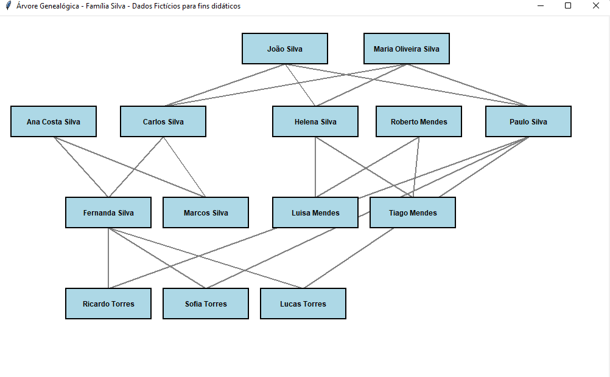

# 📚 Diário de Aprendizado: Árvore Genealógica em Python

Este documento registra a evolução técnica do projeto, desde a lógica de objetos até a interface gráfica com Tkinter.

---

## 🚀 Fase 1: Modelagem de Dados (OOP)
No início, o foco foi entender como representar uma pessoa e seus vínculos.
- **Conceito Chave:** Programação Orientada a Objetos (POO).
- **Desafio:** Como conectar pais e filhos sem criar um loop infinito de memória?
- **Solução:** Criar métodos `adcionar_pai` e `adcionar_mae` que atualizam automaticamente a lista de filhos do progenitor.

## 🎨 Fase 2: Visualização com Tkinter
Após estruturar os dados, o próximo passo foi levar os nomes para uma interface visual.
- **Aprendizado:** Sistema de coordenadas cartesianas (X, Y).
- **Lógica:** - O eixo **X** controla a largura (irmãos e cônjuges).
  - O eixo **Y** controla a altura (gerações/tempo).

## 🔗 Fase 3: Algoritmo de Conexão (Relações)
A fase mais complexa foi desenhar as linhas de parentesco.
- **Problema:** Como saber quem ligar a quem?
- **Solução:** Criar um loop que percorre cada objeto e verifica se os atributos `self.pai` ou `self.mae` não estão vazios (`None`). Se existirem, o programa traça uma linha entre as coordenadas do pai e as coordenadas do filho.

## 🛠️ Refatoração e Correções
Durante o processo, identifiquei e corrigi erros comuns:
1. **Ordem de Renderização:** Aprendi que desenhar as linhas *antes* dos retângulos faz com que o visual fique mais limpo (a linha fica "atrás" da caixa).
2. **Nomes Variáveis:** Ajustei nomes de variáveis para evitar conflitos em loops (`p_obj` em vez de apenas `p`).

---

## 📈 Próximos Passos
- [ ] Implementar um sistema de busca por nome.
- [ ] Adicionar interatividade (clicar na caixa para ver a profissão).
- [ ] Exportar a árvore como imagem PNG.

